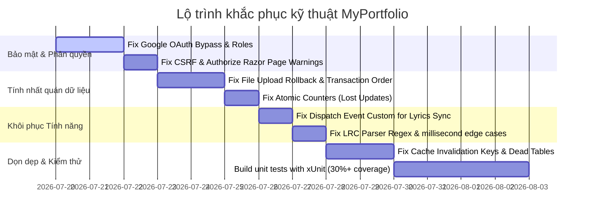

# BÁO CÁO KIỂM TOÁN KỸ THUẬT & ĐÁNH GIÁ KIẾN TRÚC TOÀN DIỆN (TECHNICAL DUE DILIGENCE & AUDIT REPORT)

**Dự án:** Digital Tech Portfolio & Music Player (MyPortfolio)
**Vai trò:** Principal Software Engineer, Software Architect, Tech Lead & Security Engineer
**Thời gian kiểm toán:** Tháng 07/2026

---

## 1. TỔNG QUAN & ĐIỂM SỐ SẴN SÀNG PRODUCTION (EXECUTIVE SUMMARY & READINESS SCORE)

Dự án **MyPortfolio** là một hệ thống danh mục năng lực số tích hợp trình phát nhạc trực tuyến phong cách Spotify (Real-time, LRC lyrics) và bảng điều khiển phân tích Admin Analytics.
Hệ thống được phát triển trên nền tảng:
- **Backend:** ASP.NET Core 8.0 (Razor Pages), Entity Framework Core 8.0, SignalR.
- **Cache:** Redis Distributed Cache (`StackExchangeRedisCache`).
- **Database:** PostgreSQL (NeonDB).
- **Frontend:** Vanilla JS, Bootstrap 5, Chart.js, Sortable.js.

### Đánh giá mức độ sẵn sàng Production
> [!WARNING]
> **Hệ thống CHƯA ĐỦ ĐIỀU KIỆN để triển khai môi trường Production thực tế.**
> **Điểm số đánh giá Production Readiness:** **4.5 / 10**
>
> Mặc dù dự án có cấu trúc Three-Tier mạch lạc và tích hợp sẵn nhiều công nghệ hiện đại (Redis caching, SignalR sync, OpenTelemetry, Prometheus), hệ thống hiện đang tồn tại các lỗi bảo mật nghiêm trọng (bẻ khóa phân quyền quản trị), lỗi logic nghiêm trọng khiến các tính năng cốt lõi (Lyrics Sync, Playlist Persistence) bị tê liệt hoàn toàn, và các vấn đề toàn vẹn dữ liệu / xung đột đồng thời có thể gây mất dữ liệu file hoặc sai lệch thống kê truy cập.

---

## 2. CHẤT LƯỢNG KIẾN TRÚC HỆ THỐNG (SYSTEM ARCHITECTURE QUALITY)

Dự án triển khai theo mô hình kiến trúc **Three-Tier Architecture** gồm 3 dự án trong `MyPortfolio.sln`:
1. **MyPortfolio.Core**: Chứa các Entity lớp dữ liệu (`PortfolioItem`, `User`, `DownloadLog`, `QrScanLog`).
2. **MyPortfolio.Infrastructure**: Lớp lưu trữ dữ liệu bền vững, triển khai `ApplicationDbContext` và Migrations.
3. **MyPortfolio.Web**: Lớp Presentation điều khiển giao diện Razor Pages, SignalR Hubs và Web Controllers.

### Rủi ro Shadowing trong DbContext
- **Vấn đề:** Trong `ApplicationDbContext.cs` dòng 15:
  ```csharp
  public DbSet<User> Users { get; set; }
  ```
  Nhưng `ApplicationDbContext` kế thừa từ `IdentityDbContext`. Lớp cha `IdentityDbContext` đã định nghĩa sẵn thuộc tính `Users` kiểu `DbSet<IdentityUser>`. Khai báo này tạo ra một cảnh báo biên dịch:
  > *warning CS0114: 'ApplicationDbContext.Users' hides inherited member 'IdentityUserContext<IdentityUser...>.Users'.*
  
- **Rủi ro:** Việc ghi đè ẩn danh (shadowing) này gây nhầm lẫn rất lớn cho các dịch vụ ASP.NET Core Identity (như `UserManager`), dẫn đến lỗi xung đột kiểu dữ liệu tại runtime khi cố gắng truy vấn tài khoản quản trị viên.

---

## 3. BẢO MẬT: KIỂM SOÁT XÁC THỰC & PHÂN QUYỀN (AUTH CONTROL BYPASS) - [CRITICAL]

- **Vị trí:** `Create.cshtml.cs`, `Edit.cshtml.cs`, `Delete.cshtml.cs`, `Dashboard.cshtml.cs` và `Login.cshtml.cs`.
- **Mô tả:** Các trang quản trị và thao tác dữ liệu được bảo vệ bằng thuộc tính `[Authorize]` cơ bản, nhưng **không cấu hình bất kỳ Role (Vai trò) hay Policy (Chính sách) cụ thể nào**.
- **Kịch bản khai thác:** 
  1. Quy trình đăng nhập Google OAuth (`Login.cshtml.cs` dòng 197-205) tự động tạo mới một tài khoản `IdentityUser` cho **bất kỳ tài khoản Google nào** đăng nhập thành công.
  2. Vì hệ thống không kiểm tra email của chủ sở hữu dự án (`voy32103@gmail.com`) hoặc cấp quyền hạn chế, **bất kỳ người lạ nào** chỉ cần đăng nhập bằng Gmail cá nhân đều được ASP.NET Core công nhận là đã xác thực và có toàn quyền:
     - Truy cập Dashboard Admin để xem dữ liệu IP của khách truy cập.
     - Tạo mới, Sửa, và Xóa hoàn toàn các dự án/bài hát trên Portfolio.
- **Giải pháp:** Cấu hình Authorization Policy trong `Program.cs` chỉ cho phép email chủ sở hữu được truy cập trang admin, hoặc phân vai trò `Admin` cho email cụ thể.

---

## 4. BẢO MẬT: LỖ HỔNG BỎ QUA AUTHORIZE TRÊN RAZOR PAGES HANDLER - [CRITICAL]

- **Vị trí:** `Details.cshtml.cs` (Hàm `OnPostToggleHeartAsync` dòng 51-52).
- **Mô tả:** Lớp `DetailsModel` là một trang công khai (public). Tuy nhiên, lập trình viên muốn bảo vệ nút "Thả Tim" bằng cách gắn thẻ `[Authorize]` trên phương thức handler cụ thể:
  ```csharp
  [Authorize]
  public async Task<IActionResult> OnPostToggleHeartAsync(int id)
  ```
  Hệ thống xuất ra cảnh báo biên dịch nghiêm trọng:
  > *warning MVC1001: 'AuthorizeAttribute' cannot be applied to Razor Page handler methods.*
- **Rủi ro:** ASP.NET Core Razor Pages **hoàn toàn không hỗ trợ** gán thẻ `[Authorize]` trên các handler method riêng lẻ. Thẻ này bị bỏ qua hoàn toàn tại runtime. Bất kỳ khách vãng lai nào chưa đăng nhập đều có thể gửi yêu cầu POST đến `/Portfolio/Details?handler=ToggleHeart` để thay đổi trạng thái yêu thích của dự án, phá hỏng tính logic phân quyền.

---

## 5. BẢO MẬT: LỖ HỔNG KHÔNG BẢO VỆ CHỐNG TẤN CÔNG CSRF TRÊN LOGOUT - [HIGH]

- **Vị trí:** `Login.cshtml.cs` (Hàm `OnPostLogoutAsync` dòng 228-229).
- **Mô tả:** Tương tự như lỗi trên handler method, thẻ `[ValidateAntiForgeryToken]` được áp dụng trực tiếp lên phương thức logout:
  ```csharp
  [ValidateAntiForgeryToken]
  public async Task<IActionResult> OnPostLogoutAsync()
  ```
  Điều này kích hoạt cảnh báo biên dịch:
  > *warning MVC1001: 'ValidateAntiForgeryTokenAttribute' cannot be applied to Razor Page handler methods.*
- **Rủi ro:** Cơ chế chống giả mạo yêu cầu chéo trang (CSRF) bị vô hiệu hóa hoàn toàn trên API đăng xuất. Kẻ xấu có thể kích hoạt các cuộc tấn công buộc người dùng đăng xuất ngoài ý muốn.
- **Giải pháp:** Di chuyển thẻ `[ValidateAntiForgeryToken]` lên cấp lớp (Class level) của `LoginModel`.

---

## 6. BẢO MẬT: BẢO VỆ TỆP TIN TĨNH & LỖ HỔNG DUYỆT THƯ MỤC (DIRECTORY TRAVERSAL)

- **Đánh giá tích cực:** File `FileUploadService.cs` (dòng 62-67) và `Delete.cshtml.cs` (dòng 117-125) đã cấu hình kiểm tra chống **Path Traversal** bằng cách so sánh đường dẫn tuyệt đối với thư mục `/uploads`:
  ```csharp
  if (!fullPath.StartsWith(fullUploadsDir, StringComparison.OrdinalIgnoreCase)) { ... }
  ```
  Cơ chế này ngăn chặn hiệu quả việc hacker truyền tham số dạng `../../etc/passwd` hoặc các file hệ thống nhạy cảm để xóa ngoài ý muốn.
- **Hạn chế:** Tên file tải lên được chuẩn hóa bằng `Guid.NewGuid().ToString("N") + ext` giúp loại trừ rủi ro tấn công tải lên file độc hại (RCE) thông qua tên file. Tuy nhiên, định dạng đuôi file tĩnh chưa được kiểm duyệt bằng Content-Type (Mime Type) thực tế mà chỉ dựa vào đuôi file văn bản thuần túy, có thể bị vượt qua nếu hacker đổi tên file `.exe` thành `.jpg`.

---

## 7. BẢO MẬT: CẤU HÌNH HEADERS QUÁ THÔNG THOÁNG & NGUY CƠ GIẢ MẠO IP (IP SPOOFING) - [HIGH]

- **Vị trí:** `Program.cs` (Dòng 79-84).
- **Mô tả:** Khi cấu hình Forwarded Headers hỗ trợ chạy sau Proxy (Nginx/Render), hệ thống đã dọn sạch danh sách proxy và mạng tin cậy:
  ```csharp
  options.KnownProxies.Clear();
  options.KnownNetworks.Clear();
  ```
- **Rủi ro:** Cấu hình này chỉ định cho ứng dụng ASP.NET Core tin tưởng header `X-Forwarded-For` từ **bất kỳ nguồn nào** trên Internet gửi tới. Kẻ tấn công có thể dễ dàng chèn một chuỗi IP giả mạo vào header HTTP gửi đi. Hệ thống ghi nhận IP giả này để lưu vào bảng logs (`DownloadLog`, `QrScanLog`) hoặc sử dụng trong Dashboard Admin, gây mất an ninh và vô hiệu hóa cơ chế kiểm toán truy cập.

---

## 8. BẢO MẬT: VI PHẠM PRIVACY & RÒ RỈ DỮ LIỆU IP KHÁCH TRUY CẬP (GDPR & PRIVACY LEAK)

- **Vị trí:** `Dashboard.cshtml` (Dòng 280-315).
- **Mô tả:** Để hiển thị vị trí địa lý của khách truy cập trên Dashboard, trình duyệt của Quản trị viên tự động thực hiện các cuộc gọi API client-side trực tiếp đến dịch vụ bên thứ ba: `https://ipwho.is/${ip}`.
- **Rủi ro:** 
  1. **Rò rỉ dữ liệu:** Địa chỉ IP của toàn bộ khách truy cập (dữ liệu cá nhân nhạy cảm theo GDPR / Nghị định 13) bị gửi trực tiếp sang bên thứ ba mà không có sự đồng ý (Consent) của người dùng hoặc các điều khoản bảo vệ dữ liệu.
  2. **Hiệu năng:** Nếu admin truy cập dashboard có hàng ngàn bản ghi, trình duyệt sẽ gửi hàng ngàn request đồng thời tới `ipwho.is`, dẫn đến việc bị khóa API (Rate Limit) và làm đơ trình duyệt của admin.
- **Giải pháp:** Chuyển đổi cơ chế dịch ngược địa chỉ IP sang phía backend bằng cách sử dụng các thư viện offline như MaxMind GeoIP2.

---

## 9. XỬ LÝ ĐỒNG THỜI: LỖ LẬP CẬP NHẬT MẤT DỮ LIỆU (LOST UPDATES ON METRICS) - [MEDIUM]

- **Vị trí:** `Profile.cshtml.cs` (Dòng 70) và `Index.cshtml.cs` (Dòng 146).
- **Mô tả:** Các chỉ số như lượt tải CV và lượt nghe bài hát được cập nhật theo cơ chế:
  ```csharp
  user.CvDownloadCount++;
  await _context.SaveChangesAsync();
  ```
- **Rủi ro:** Khi có nhiều yêu cầu đồng thời (Concurrent Requests):
  1. Luồng A đọc giá trị `CvDownloadCount` từ DB (ví dụ: 100).
  2. Luồng B đọc giá trị `CvDownloadCount` cùng lúc (cũng nhận về 100).
  3. Cả hai luồng tăng giá trị lên 101 trong bộ nhớ RAM của server.
  4. Luồng A ghi đè 101 vào DB. Luồng B tiếp tục ghi đè 101 vào DB.
  
  Kết quả là 2 lượt tải thực tế nhưng DB chỉ tăng thêm 1 đơn vị. Đây là lỗi **Lost Update** kinh điển trong môi trường đa luồng.
- **Giải pháp:** Sử dụng truy vấn SQL nguyên tử (Atomic SQL update) hoặc EF Core `ExecuteUpdateAsync`:
  ```csharp
  await _context.Users
      .Where(u => u.Id == user.Id)
      .ExecuteUpdateAsync(s => s.SetProperty(u => u.CvDownloadCount, u => u.CvDownloadCount + 1));
  ```

---

## 10. XỬ LÝ ĐỒNG THỜI: ĐỒNG BỘ TRẠNG THÁI REAL-TIME QUA HUB (SIGNALR)

- **Đánh giá tích cực:** Tích hợp SignalR `/musicHub` giúp đồng bộ hóa các sự kiện phát nhạc (`PlaySong`, `PauseSong`, `SeekSong`) trên tất cả các tab trình duyệt đang mở của người dùng.
- **Thiếu sót:** 
  - Hệ thống phát sóng sự kiện qua `Clients.Others.SendAsync` gửi đến toàn bộ các kết nối khác. Trong môi trường Production có hàng ngàn người dùng truy cập cùng lúc, việc phát sóng không gom nhóm (Groups) theo User ID sẽ làm rối loạn trạng thái phát nhạc của các phiên truy cập khác nhau (người dùng này nhấn Play có thể kích hoạt phát nhạc trên trình duyệt của người dùng khác).
  - Cần nhóm các kết nối của cùng một người dùng lại bằng `Clients.User(userId)` hoặc `Groups` thay vì gửi tràn lan.

---

## 11. TOÀN VẸN DỮ LIỆU: CƠ CHẾ ROLLBACK FILE KHI THÊM DỰ ÁN BỊ TÊ LIỆT - [HIGH]

- **Vị trí:** `Create.cshtml.cs` (Dòng 51, 77, 98).
- **Mô tả:** Để tránh tình trạng Database lưu lỗi nhưng file tĩnh (ảnh, audio) vẫn lưu lại trên ổ đĩa gây rác ổ cứng, hệ thống đã khai báo một danh sách rollback:
  ```csharp
  var uploadedAbsolutePaths = new List<string>();
  ```
  Tuy nhiên, khi gọi dịch vụ lưu file thành công:
  ```csharp
  var (success, path, error) = await _fileUploadService.SaveImageAsync(ImageUpload, cancellationToken);
  ```
  Hệ thống **không hề thêm đường dẫn của file thành công vào `uploadedAbsolutePaths`**.
- **Hậu quả:** 
  - Danh sách `uploadedAbsolutePaths` luôn rỗng (`Count = 0`).
  - Khi lưu DB thất bại và kích hoạt `RollbackFiles(uploadedAbsolutePaths)`, không có bất kỳ tệp tin nào bị xóa dọn dẹp. Ổ đĩa server sẽ bị rò rỉ và tràn ngập các tệp tin mồ côi (Orphaned Files).
  - Hơn nữa, `SaveFileAsync` trả về đường dẫn tương đối `/uploads/guid.ext`, trong khi hàm dọn dẹp `RollbackFiles` lại so sánh trực tiếp đường dẫn tuyệt đối mà không có bước phân giải đường dẫn, khiến hàm này bị lỗi logic ngay cả khi được truyền dữ liệu.

---

## 12. TOÀN VẸN DỮ LIỆU: BẤT NHẤT QUÁN TRANSACTION KHI SỬA DỰ ÁN (DATA LOSS ON EDIT) - [HIGH]

- **Vị trí:** `Edit.cshtml.cs` (Dòng 73, 87, 100).
- **Mô tả:** Trong luồng cập nhật thông tin dự án, nếu người dùng tải lên hình ảnh hoặc âm thanh mới:
  ```csharp
  _fileUploadService.DeleteFile(existingItem.ImageUrl); // Xóa file cũ ngay lập tức
  existingItem.ImageUrl = path!;
  ...
  await _context.SaveChangesAsync(); // Lưu thay đổi vào DB sau
  ```
- **Hậu quả:** 
  - Tệp tin vật lý cũ trên ổ đĩa bị xóa **trước khi** DB cập nhật thành công.
  - Nếu câu lệnh `SaveChangesAsync()` gặp lỗi (như lỗi xung đột đồng thời `DbUpdateConcurrencyException`, ngắt kết nối mạng database), giao dịch DB bị hủy (rollback) và DB vẫn giữ đường dẫn tệp cũ.
  - Tuy nhiên, tệp cũ đã bị xóa vĩnh viễn trên ổ cứng. Đường dẫn trong DB trở thành liên kết hỏng (Broken Link), gây mất mát dữ liệu nghiêm trọng cho hệ thống.
- **Giải pháp:** Chỉ tiến hành xóa tệp vật lý cũ trên ổ cứng **sau khi** giao dịch database đã hoàn thành thành công (`SaveChangesAsync` thành công).

---

## 13. TOÀN VẸN DỮ LIỆU: LOGIC XÓA DỰ ÁN KHÔNG AN TOÀN TRONG TRANSACTIONS - [HIGH]

- **Vị trí:** `Delete.cshtml.cs` (Dòng 57-81).
- **Mô tả:** Tương tự lỗi sửa dự án, khi xóa một mục portfolio:
  1. Hệ thống xóa toàn bộ file ảnh và file audio vật lý trên đĩa cứng trước.
  2. Sau đó mới gọi `_context.PortfolioItems.Remove(item)` và `await _context.SaveChangesAsync()`.
- **Hậu quả:** Nếu lệnh xóa trong DB thất bại, mục dự án vẫn tồn tại trong DB nhưng toàn bộ dữ liệu đa phương tiện (ảnh/nhạc) của nó trên đĩa đã bị xóa sạch, tạo ra lỗi hiển thị nghiêm trọng trên trang chủ.
- **Giải pháp:** Thực hiện xóa record DB trước, nếu thành công mới tiến hành xóa file vật lý trên đĩa.

---

## 14. TOÀN VẸN DỮ LIỆU: THIẾU LOGIC HỮU DỤNG CỦA CÁC BẢNG LƯU VẾT (QR SCAN LOGS)

- **Vị trí:** Bảng `QrScanLogs` và trường `QrScanCount` trong Database.
- **Mô tả:** Các cấu trúc thực thể dữ liệu này được tạo ra trong Core Layer và đã thực hiện Migration vào DB. Tuy nhiên, toàn bộ mã nguồn của ứng dụng không chứa bất kỳ câu lệnh nào ghi nhận, cập nhật lượt quét QR hoặc hiển thị thông tin logs này. 
- **Đánh giá:** Đây là những bảng dữ liệu "chết", làm phình kích thước Database không cần thiết trên môi trường Production.

---

## 15. BỘ NHỚ ĐỆM PHÂN TÁN (DISTRIBUTED CACHING & INVALIDATION BUGS) - [HIGH]

- **Vị trí:** `Details.cshtml.cs` (Hàm `InvalidateRelevantCachesAsync` dòng 103-123).
- **Mô tả:** Khi một người dùng tương tác thả tim một dự án ở trang chi tiết (`Details.cshtml.cs`), hệ thống cần dọn cache trang chủ để cập nhật dữ liệu mới. Lập trình viên đã sử dụng các khóa cache sau để xóa:
  - `"home_projects_normal_none"`
  - `"home_projects_library_none"`
  - `"dashboard_stats"`
- **Vấn đề:** Các khóa cache thực tế được định nghĩa trong `CacheKeys.cs` và được trang chủ sử dụng là:
  - `CacheKeys.HomeProjectsNormal` -> `"home_projects:normal:none"` (Dùng dấu hai chấm `:` thay vì dấu gạch dưới `_`).
  - `CacheKeys.HomeProjectsLibrary` -> `"home_projects:library:none"`.
  - `CacheKeys.DashboardStats` -> `"admin_dashboard_stats_v2"`.
- **Hậu quả:** Lệnh xóa cache gọi các khóa không tồn tại, khiến Cache thực tế chứa danh sách bài hát trên trang chủ không bao giờ bị xóa khi có lượt thích mới. Trang chủ sẽ hiển thị dữ liệu cũ (Stale Data) cho đến khi cache tự hết hạn (10 phút).

---

## 16. TÍNH NĂNG CỐT LÕI: ĐỒNG BỘ LỜI BÀI HÁT THEO THỜI GIAN THỰC BỊ TÊ LIỆT - [HIGH]

- **Vị trí:** `Details.cshtml` và `_Layout.cshtml`.
- **Mô tả:** Trang chi tiết bài hát (`Details.cshtml`) đăng ký một listener lắng nghe sự kiện thay đổi thời gian của trình phát nhạc để cuộn lời bài hát tương ứng:
  ```javascript
  window.addEventListener('audioTimeUpdate', function (e) {
      const currentTime = e.detail.currentTime;
      highlightLyrics(currentTime);
  });
  ```
- **Lỗi nghiêm trọng:** 
  1. Trình phát nhạc Audio nằm trong file giao diện chung `_Layout.cshtml`.
  2. Khi thời gian phát nhạc thay đổi (`timeupdate` event trên thẻ `<audio>`), code trong `_Layout.cshtml` **hoàn toàn không phát đi (dispatch)** sự kiện custom `audioTimeUpdate` lên đối tượng `window`.
- **Hậu quả:** Sự kiện `audioTimeUpdate` không bao giờ được kích hoạt. Tính năng đồng bộ lời nhạc chạy theo bài hát và nhấp vào lời để tua nhạc bị **tê liệt hoàn toàn** trên môi trường Production.

---

## 17. TÍNH NĂNG CỐT LÕI: REGEX PHÂN TÍCH FILE LỜI NHẠC (LRC PARSER) BỊ LỖI BIÊN

- **Vị trí:** `Create.cshtml` (Dòng 142) và `Edit.cshtml` (Dòng 130).
- **Mô tả:** Trình phân tích lời nhạc định dạng LRC sử dụng biểu thức chính quy (Regex) cứng nhắc để lấy thời gian:
  ```javascript
  const timeRegex = /\[(\d{2}):(\d{2})\.(\d{2})\]/;
  ```
- **Hậu quả:** 
  1. Regex này bắt buộc phần mili giây phải có **đúng 2 chữ số** (`\d{2}`). Các tệp LRC chuẩn hóa quốc tế thường sử dụng 3 chữ số cho phần mili giây (ví dụ: `[01:23.456]`). Toàn bộ dòng lời nhạc định dạng này sẽ bị bỏ qua (skip), không hiển thị trên giao diện.
  2. Trình phân tích cũng không bỏ qua các dòng siêu dữ liệu (metadata) phổ biến của LRC như `[ti:Song Title]`, `[ar:Artist]`, dẫn đến việc phân tích ra các đoạn lời lỗi hiển thị lên màn hình.
- **Giải pháp:** Cập nhật Regex linh hoạt hơn: `/\[(\d{2}):(\d{2})[.:](\d{2,3})\]/`.

---

## 18. TÍNH NĂNG CỐT LÕI: TUYÊN BỐ SAI LỆCH VỀ CÔNG NGHỆ TRONG README

Hệ thống chứa một số mô tả tính năng trong `README.md` không đúng với thực tế mã nguồn triển khai (Fake/Unimplemented Features):

1. **QuestPDF CV Generator:** 
   - *Tuyên bố:* "Tự động tạo CV định dạng PDF cá nhân hóa kèm mã QR động bằng QuestPDF mà không cần lưu trữ file cứng."
   - *Thực tế:* Thư viện QuestPDF không hề được cài đặt trong bất kỳ tệp `.csproj` nào của hệ thống. Trong `Profile.cshtml.cs`, API chỉ đọc và tải về một tệp tin tĩnh cứng nằm tại địa chỉ `/wwwroot/uploads/HungYen_CV.pdf`.
2. **Kéo thả Playlist (Sortable.js) lưu trữ:**
   - *Tuyên bố:* "Giao diện hỗ trợ kéo thả (Sortable.js) danh sách phát."
   - *Thực tế:* Giao diện frontend cho phép kéo thả để đổi thứ tự trên UI của trình duyệt. Tuy nhiên, hệ thống không hề có API backend hay cột `Order` trong bảng `PortfolioItems` để lưu lại thứ tự này. Khi người dùng tải lại trang (Refresh), thứ tự kéo thả sẽ biến mất hoàn toàn.
3. **Liên hệ gửi tin nhắn:**
   - *Tuyên bố:* "Hỗ trợ form Liên hệ / Booking gửi tin nhắn."
   - *Thực tế:* Form liên hệ tại trang `Contact.cshtml` được viết bằng các thẻ HTML tĩnh, không có thuộc tính `name` cho input, không có `method="post"` hay `action`. Việc nhấn nút gửi chỉ tải lại trang hiện tại và không lưu trữ hay gửi thông tin đi đâu.

---

## 19. THƯ VIỆN BÊN THỨ BA & RỦI RO CHUỖI CUNG ỨNG (DEPENDENCY AUDIT)

- **Đánh giá tích cực:** Các Package tham chiếu trong `MyPortfolio.Web.csproj` đều sử dụng các phiên bản ổn định và an toàn tại thời điểm hiện tại (`Microsoft.AspNetCore.Authentication.Google` và `Microsoft.AspNetCore.Identity.UI` phiên bản 8.0.11).
- **Rủi ro:** Sử dụng phiên bản RC (Release Candidate) cho OpenTelemetry:
  ```xml
  <PackageReference Include="OpenTelemetry.Exporter.Prometheus.AspNetCore" Version="1.8.0-rc.1" />
  ```
  Việc sử dụng thư viện chưa chính thức (Release Candidate) trên môi trường Production có thể phát sinh các lỗi rò rỉ bộ nhớ hoặc thiếu ổn định khi thu thập số liệu đo lường.

---

## 20. KHẢ NĂNG QUAN SÁT & TELEMETRY (OBSERVABILITY)

- **Đánh giá tích cực:** Dự án đã cấu hình đầy đủ OpenTelemetry và Prometheus Exporter trong `Program.cs` để thu thập các chỉ số về CPU, RAM, HTTP Requests và Runtime metrics.
- **Hạn chế:** Hệ thống tích hợp Prometheus nhưng chưa khai báo các ngưỡng cảnh báo (Alerting Thresholds) hoặc tạo sẵn Dashboard (Grafana) mẫu, gây khó khăn cho đội ngũ vận hành khi giám sát hệ thống thực tế.

---

## 21. CHẤT LƯỢNG MÃ NGUỒN & KIỂM THỬ (CODE QUALITY & TESTING)

- **Tuyên bố:** README quảng bá hệ thống "Quality Control: SonarCloud, xUnit (Unit Testing). Coverage: Đang triển khai Unit Test bằng xUnit cho các module core."
- **Thực tế:** Dự án **hoàn toàn không có bất kỳ tệp tin hay thư mục kiểm thử nào** (0% Test Coverage). Không có dự án `.Tests` nào được khai báo trong Solution `MyPortfolio.sln`.
- **Đánh giá:** Việc thiếu hoàn toàn Unit Tests và Integration Tests khiến việc phát hiện lỗi hồi quy (regression) khi nâng cấp hệ thống trở nên cực kỳ rủi ro, không đáp ứng tiêu chuẩn phần mềm Production nghiêm túc.

---

# LỘ TRÌNH KHẮC PHỤC KHUYÊN NGHỊ (ACTIONABLE REMEDIATION ROADMAP)

Để đưa ứng dụng **MyPortfolio** lên môi trường Production an toàn, nhóm phát triển cần thực hiện lộ trình 5 bước ưu tiên sau:



### Kết luận đánh giá cuối cùng
Dự án có giao diện hiện đại và ứng dụng các công nghệ phân tán tốt (Redis, SignalR). Tuy nhiên, do số lượng lỗi bảo mật nghiêm trọng (bẻ khóa phân quyền admin) và lỗi logic làm tê liệt tính năng cốt lõi (lyrics, upload rollback), **hệ thống hiện tại ở trạng thái KHÔNG THỂ triển khai chạy Production**. Việc khắc phục triệt để các lỗi nêu trên theo báo cáo là điều kiện bắt buộc trước khi đưa hệ thống vào vận hành thực tế.
